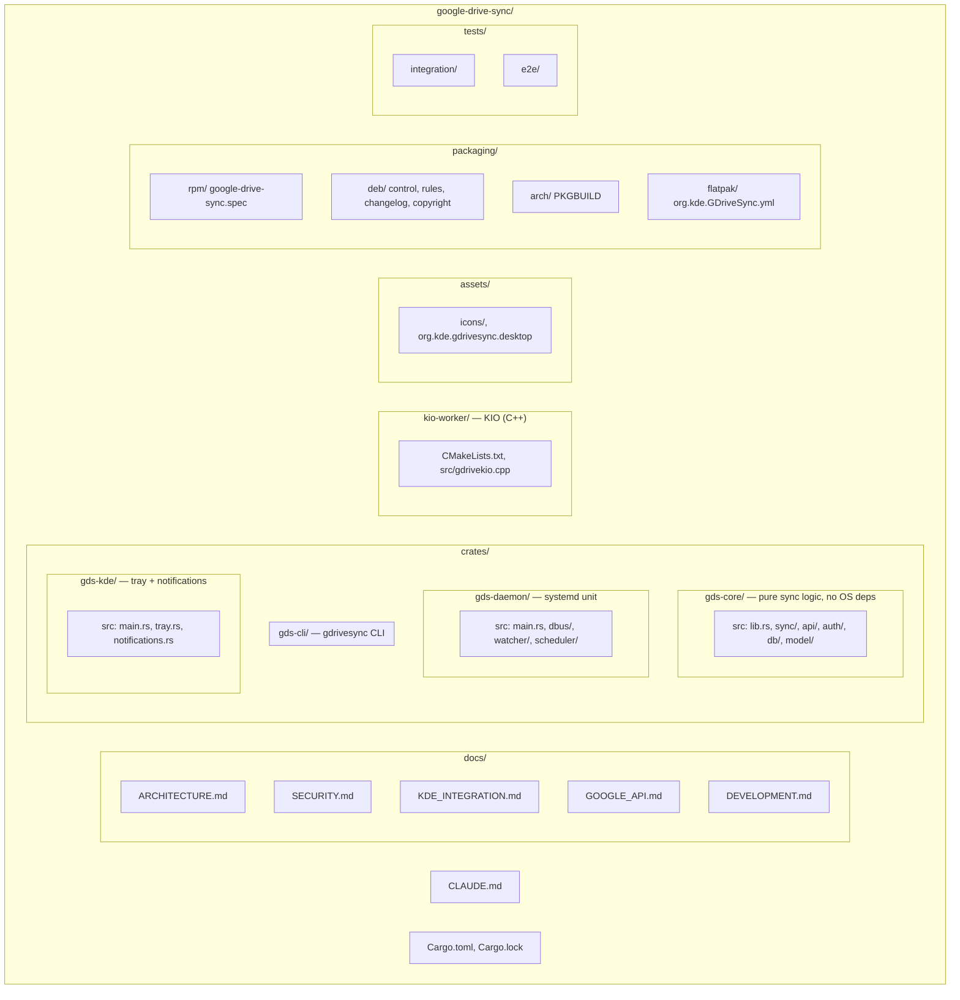

# Google Drive Sync for KDE — Claude Development Guide

## Project Purpose

A native KDE Plasma Google Drive sync client. Goals: seamless desktop integration
(system tray, Dolphin via KIO, KDE notifications), real-time bidirectional sync,
OAuth2 security, and zero unsafe memory patterns. Targets Fedora, Arch, openSUSE,
Ubuntu — cross-distribution via static linking.

## Language & Stack

**Language: Rust (stable toolchain)**

| Layer | Technology |
|---|---|
| Async runtime | Tokio |
| HTTP / Google API | reqwest + oauth2 crate |
| File watching | notify (inotify on Linux) |
| KDE system tray | ksystemtray via D-Bus (zbus) |
| KDE notifications | zbus → org.kde.KNotification |
| Dolphin integration | KIO worker (C++ shim, thin layer only) |
| Config / secrets | keyring crate (libsecret backend) |
| Serialization | serde + serde_json |
| Logging | tracing + tracing-subscriber |
| CLI | clap |
| IPC daemon ↔ UI | zbus (D-Bus) |
| GUI (optional tray) | egui or native QML via cxx-qt |
| Database (local state) | sqlite via sqlx (async) |

## Repository Layout



## Core Architectural Rules

1. **gds-core is pure logic** — no OS calls, no D-Bus, no file system I/O outside
   its own abstraction traits. Everything injectable via traits (Strategy pattern).
   This makes unit testing trivial and the library portable.

2. **Daemon owns all state** — the UI (tray, CLI) communicates only via D-Bus.
   Never let UI hold sync state. Single source of truth.

3. **Never store tokens in plain files** — all secrets go through `keyring` crate
   (libsecret / KWallet backend). See `docs/SECURITY.md`.

4. **Conflict policy is explicit** — default: server wins + keep local copy as
   `filename.conflict-YYYYMMDD-HHMMSS.ext`. Never silently overwrite.

5. **All network calls are async** — no blocking in Tokio tasks. Use
   `tokio::task::spawn_blocking` only for truly blocking operations.

6. **Rate limiting is mandatory** — respect Google API quotas. Use exponential
   backoff with jitter. Never retry hot-loop on 429/503.

7. **Logging levels**:
   - `ERROR`: data loss risk, auth failure, unrecoverable
   - `WARN`: retry, conflict, degraded
   - `INFO`: sync start/stop, file events (minimal)
   - `DEBUG`: API calls, state transitions
   - `TRACE`: request/response bodies (never in release builds)

## Documentation

- **Diagrams must be Mermaid** — Use Mermaid only for all diagrams (architecture, flowcharts, state machines, dependency graphs) in README, CLAUDE.md, and under `docs/`. GitHub and many viewers render Mermaid; do not use ASCII box-drawing diagrams.

## Production-Ready Code Standard

**This is non-negotiable. Every line of code written in this project must be
production-ready and complete. No exceptions.**

### What this means in practice

- **No placeholders** — `todo!()`, `unimplemented!()`, `panic!("implement me")`,
  stub functions that return `Ok(())` without doing real work, and comments like
  `// TODO: implement this` are forbidden in committed code. If a feature is not
  ready, it does not get merged.

- **No partial features** — a feature is either fully implemented with tests,
  or it doesn't exist in the codebase. Half-built features create technical debt
  and false confidence. Do not commit incomplete sync logic, incomplete error
  handling, or incomplete UI elements expecting to "fill it in later."

- **Every code path handles errors** — there are no ignored `Result`s, no
  `let _ = something_that_can_fail()`, no swallowed errors. Every failure mode
  is handled explicitly: logged, propagated, retried, or reported to the user.

- **Every public function has tests** — unit tests for pure logic, integration
  tests for I/O-touching code. If you write a function, you write its tests in
  the same commit.

- **No hardcoded values that should be configurable** — timeouts, retry counts,
  poll intervals, chunk sizes all come from `Config`, not magic numbers in code.

- **No commented-out code** — dead code is deleted, not commented out. Git
  history exists for a reason.

- **Security properties are verified, not assumed** — if a function has a
  security invariant (e.g., "path is always within sync root"), it is enforced
  with a runtime check and tested with an adversarial test case.

### The bar to clear before committing

Ask: "Would I be comfortable deploying this to a user's machine right now?"
If the answer is no — fix it first.

---

## Coding Standards

### Rust

- **Clippy must pass**: `cargo clippy -- -D warnings` in CI
- **No `unwrap()` or `expect()` in library code** — propagate with `?`, use
  `anyhow::Result` in binaries, `thiserror` for library errors
- **No `unsafe`** except in the KIO C++ FFI boundary, which must be isolated and
  documented with a safety comment
- Prefer `Arc<T>` over `Rc<T>` — daemon is multithreaded
- Use `tracing::instrument` on all public async functions
- Format: `cargo fmt` enforced by CI

### Error Handling Pattern

```rust
// Library crates: typed errors
#[derive(thiserror::Error, Debug)]
pub enum SyncError {
    #[error("API quota exceeded: retry after {retry_after}s")]
    QuotaExceeded { retry_after: u64 },
    #[error("Conflict detected for file {path}")]
    Conflict { path: PathBuf },
    // ...
}

// Binary crates: anyhow for ergonomics
use anyhow::{Context, Result};
fn main() -> Result<()> {
    do_thing().context("failed to initialize sync engine")?;
    Ok(())
}
```

### Security-Critical Code

Tag security-sensitive areas with `// SECURITY:` comments explaining the
invariant being maintained. These sections require 2-reviewer approval in PR.

## Google Drive API Guidelines

- Use **Drive API v3** (not v2)
- Use **pageToken-based sync** (`changes.list` with `includeItemsFromAllDrives`)
- Use **partial responses** (`fields` parameter) — never fetch full resource
  unless needed. Saves quota and bandwidth.
- **Never log OAuth tokens, refresh tokens, or file content**
- Prefer **resumable uploads** for files > 5 MB
- Implement **exponential backoff**: `min(2^attempt * 100ms + jitter, 32s)`
- Store `nextPageToken` and `startPageToken` in SQLite — survive restarts

## KDE Integration Guidelines

- Use `org.kde.StatusNotifierItem` for system tray (not deprecated XEmbed)
- Notifications via `org.freedesktop.Notifications` with KDE-specific hints
- KIO worker must implement `listDir`, `get`, `put`, `stat`, `del`, `mkdir`
- Register D-Bus service as `org.kde.GDriveSync`
- Ship a `.desktop` file for autostart at login
- Support KWallet as fallback if libsecret is unavailable

## Testing Strategy

| Test type | Location | What |
|---|---|---|
| Unit | `crates/*/src/**` | Pure logic, no I/O |
| Integration | `tests/integration/` | Real SQLite, mock HTTP |
| E2E | `tests/e2e/` | Real Drive API, test account |
| Manual KDE | `docs/DEVELOPMENT.md` | Tray, KIO, notifications |

- Mock the Google API with `wiremock` crate in integration tests
- Never use real OAuth tokens in CI — use a mock server
- E2E tests are opt-in via `RUN_E2E=1` env var and a test Google account

## Performance Targets

| Metric | Target |
|---|---|
| Daemon idle RSS | < 50 MB |
| File event → sync start | < 500 ms |
| 1000-file initial sync | < 60 s (network permitting) |
| UI response (tray click) | < 100 ms |
| CPU on idle | < 0.5% |

## Build Commands

```bash
# Full build
cargo build --workspace

# Release (production)
cargo build --workspace --release

# Lint
cargo clippy --workspace -- -D warnings

# Format
cargo fmt --all

# Tests
cargo test --workspace

# KIO worker (requires cmake, KDE Frameworks dev packages)
cd kio-worker && cmake -B build && cmake --build build

# Run daemon (dev)
RUST_LOG=debug cargo run -p gds-daemon

# Run tray UI
cargo run -p gds-kde
```

## Environment Variables (Development)

| Variable | Purpose |
|---|---|
| `RUST_LOG` | Log level filter (e.g. `gds_daemon=debug,gds_core=trace`) |
| `GDS_CONFIG_DIR` | Override config directory (default: `~/.config/gds`) |
| `GDS_DATA_DIR` | Override data directory (default: `~/.local/share/gds`) |
| `GDS_MOCK_API` | Point to local mock server instead of Google |
| `RUN_E2E` | Enable E2E tests against real Google API |

## D-Bus Interface (`org.kde.GDriveSync`)

```
Interface: org.kde.GDriveSync.Daemon
Methods:
  GetStatus() → (status: String, syncing_count: u32)
  PauseSync()
  ResumeSync()
  ForceSync(path: String)
  GetAccounts() → Array<AccountInfo>
  AddAccount()           ← triggers OAuth browser flow
  RemoveAccount(id: String)
  GetSyncFolders() → Array<SyncFolder>
  AddSyncFolder(local_path: String, drive_folder_id: String)
  RemoveSyncFolder(id: String)

Signals:
  SyncStarted(account_id: String, path: String)
  SyncCompleted(account_id: String, path: String, files_synced: u32)
  SyncError(account_id: String, path: String, error: String)
  ConflictDetected(local_path: String, conflict_copy: String)
  StatusChanged(new_status: String)
```

## PR & Commit Conventions

- Commits: `feat:`, `fix:`, `sec:`, `perf:`, `refactor:`, `test:`, `docs:`
- PRs touching `auth/` or `SECURITY.md` require `sec:` prefix and extra review
- Never commit `.env`, `client_secret.json`, or any credential file
- Add `client_secret*.json` and `.env` to `.gitignore` before first commit

## Distribution Targets

Three mandatory delivery formats. All three must be maintained and functional.

### 1. Native RPM (Fedora, RHEL, openSUSE)

- Spec file: `packaging/rpm/google-drive-sync.spec`
- Build: `rpmbuild -ba packaging/rpm/google-drive-sync.spec`
- Links against system libraries (openssl, libsecret, dbus)
- Ships systemd user unit + .desktop autostart file
- Target repos: Fedora COPR, openSUSE OBS

### 2. Native DEB (Ubuntu, Debian, Linux Mint)

- Package files: `packaging/deb/`
- Build: `dpkg-buildpackage -us -uc` or `debuild`
- Links against system libraries
- Ships systemd user unit + .desktop autostart file
- Target repo: PPA on Launchpad

### 3. Flatpak (Universal, sandboxed)

- Manifest: `packaging/flatpak/org.kde.GDriveSync.yml`
- Runtime: `org.kde.Platform//6.8`
- Build: `flatpak-builder --install build-dir packaging/flatpak/org.kde.GDriveSync.yml`
- Bundles all Rust dependencies; links KDE runtime from Flatpak
- Required Flatpak permissions:
  ```yaml
  finish-args:
    - --share=network
    - --share=ipc
    - --socket=wayland
    - --socket=fallback-x11
    - --filesystem=home          # for sync folders
    - --talk-name=org.freedesktop.Notifications
    - --talk-name=org.kde.StatusNotifierWatcher
    - --talk-name=org.freedesktop.secrets
    - --talk-name=org.kde.kwalletd5
    - --talk-name=org.kde.kwalletd6
  ```
- Target: Flathub

### Packaging Rules

- All three must be updated **in the same PR** as any binary/install change.
- Version numbers are single-sourced from `Cargo.toml` workspace version.
- A `make-release.sh` script automates tagging + building all three formats.
- Never ship debug symbols in any distribution artifact.

## First Implementation Order

See `TODO.md` for the full phased roadmap. High-level sequence:

1. `gds-core`: domain model + error types
2. `gds-core`: Google Drive API client (complete, with all upload strategies)
3. `gds-core`: OAuth2 flow (complete, with token refresh)
4. `gds-core`: local SQLite state store (full schema, migrations)
5. `gds-core`: sync engine (diff, conflict detection, resolution)
6. `gds-daemon`: file watcher (inotify, debouncing, recursive)
7. `gds-daemon`: D-Bus service (full interface, all methods + signals)
8. `gds-daemon`: scheduler (rate limiting, backoff, queue management)
9. `gds-cli`: all commands (status, accounts, sync, config)
10. `gds-kde`: system tray (SNI, full context menu, state-driven icon)
11. `gds-kde`: notifications (all notification types, action buttons)
12. `kio-worker`: Dolphin integration (all KIO methods)
13. Packaging: RPM spec, DEB rules, Flatpak manifest
14. CI/CD: full pipeline with packaging artifacts
