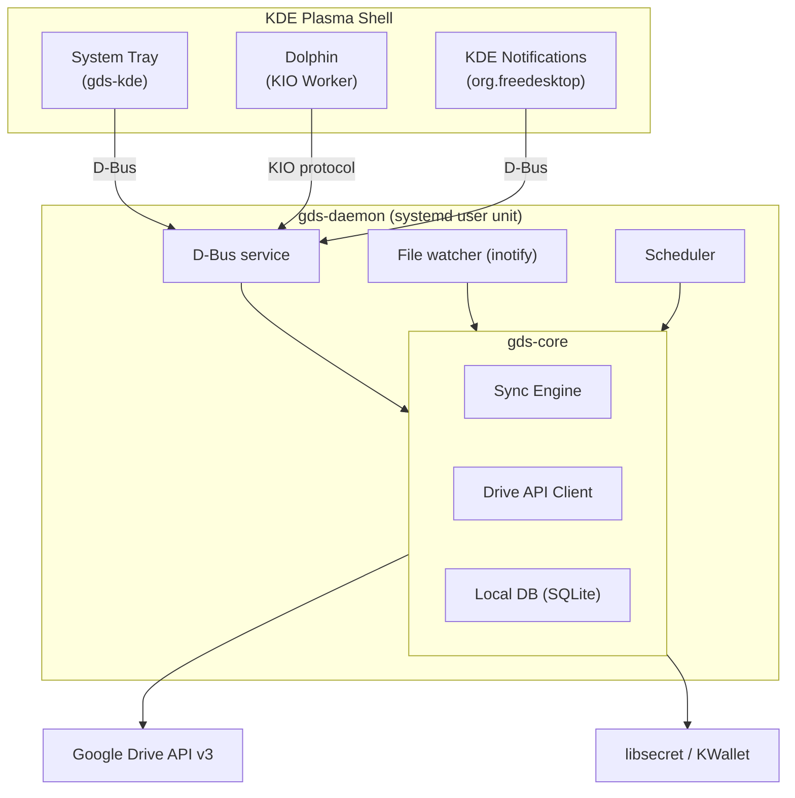
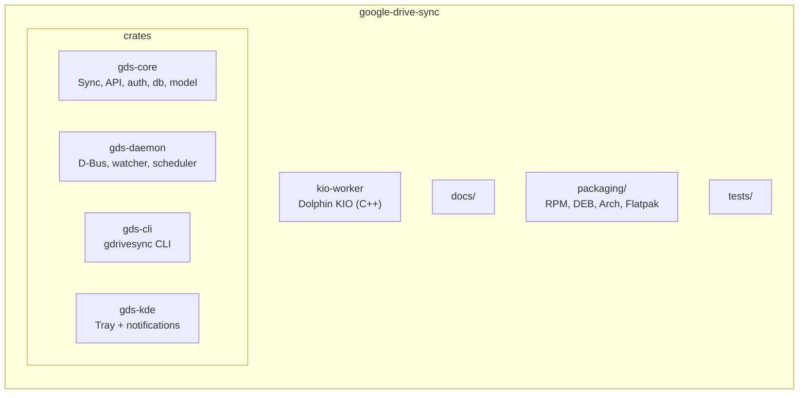

# Google Drive Sync for KDE

**A native KDE Plasma client for Google Drive** — bidirectional sync with system tray, Dolphin integration, and KDE notifications. Built in Rust for safety, speed, and seamless desktop integration.

[](TODO.md)
[](https://www.rust-lang.org/)
[](LICENSE)

> **Disclaimer:** This project is **work in progress**. It is not production-ready. APIs, behaviour, and packaging may change. Use at your own risk. See [TODO.md](TODO.md) for the roadmap and current status.

---

## Features

- **Bidirectional sync** — Keep a local folder in sync with a Google Drive folder. Changes on either side are detected and synced.
- **Native KDE integration**
  - **System tray** — Status icon, last sync time, pause/resume, force sync, open in browser.
  - **Dolphin** — Browse Drive via the KIO protocol (`gdrive:/`).
  - **Notifications** — Sync complete, conflicts, errors, and auth prompts.
- **Security-first**
  - OAuth2 with PKCE; tokens stored in **libsecret** or **KWallet**, never in config files.
  - Path traversal protection; no `unsafe` in the Rust codebase (except a documented KIO FFI boundary).
- **Conflict handling** — Server wins by default; your local version is kept as `filename.conflict-YYYYMMDD-HHMMSS.ext`.
- **Cross-distribution** — Target Fedora, Arch, openSUSE, Ubuntu. Delivered as RPM, DEB, and Flatpak.

---

## Status

**Work in progress.** The core domain model and project layout are in place. Sync engine, daemon, CLI, and KDE UI are in progress. The project is not ready for production use. See [TODO.md](TODO.md) for the full roadmap.

---

## Architecture



- **gds-core** — Pure sync logic and domain model (no OS deps; testable).
- **gds-daemon** — Background service: file watching, rate limiting, D-Bus API.
- **gds-cli** — `gdrivesync` command-line tool (talks to daemon via D-Bus).
- **gds-kde** — Tray icon and notifications.
- **kio-worker** — Thin C++ KIO worker so Dolphin can browse Drive.

---

## Requirements

- **Rust** 1.70+
- **Linux** with a KDE Plasma session (or compatible D-Bus + libsecret)
- **System libs**: OpenSSL, SQLite, D-Bus, libsecret (and KF6 for the KIO worker)

See [docs/DEVELOPMENT.md](docs/DEVELOPMENT.md) for distro-specific packages (Fedora, Arch, Ubuntu).

---

## Installation

### From source (current)

```bash
git clone https://github.com/your-org/google-drive-sync.git
cd google-drive-sync
cargo build --release --workspace
```

Binaries are in `target/release/`:

- `gds-daemon` — background service
- `gdrivesync` — CLI
- `gds-kde` — tray and notifications

Packaging (RPM, DEB, Flatpak) is planned; see [TODO.md](TODO.md) Phase 6.

---

## Quick start (when implemented)

1. **Start the daemon** (e.g. via systemd user unit or `gds daemon start`).
2. **Add a Google account** — `gdrivesync accounts add` (opens browser for OAuth).
3. **Add a sync folder** — `gdrivesync folders add /path/to/local/folder <drive-folder-id>`.
4. Sync runs automatically; use the tray icon or `gdrivesync status` to check.

Config (non-secret): `~/.config/gds/config.toml`. Secrets live in the system keyring only.

---

## Configuration

Example `~/.config/gds/config.toml`:

```toml
[oauth]
client_id = "YOUR_CLIENT_ID.apps.googleusercontent.com"
redirect_port = 8765

[sync]
poll_interval_secs = 30
max_concurrent_uploads = 2
max_concurrent_downloads = 4

[ui]
show_notifications = true
notification_timeout_ms = 5000
```

You need a Google Cloud OAuth 2.0 Desktop client ID; see [docs/GOOGLE_API.md](docs/GOOGLE_API.md).

---

## Development

```bash
# Build
cargo build --workspace

# Tests
cargo test --workspace

# Lint
cargo clippy --workspace -- -D warnings
cargo fmt --all
```

| Env var        | Purpose                                      |
|----------------|----------------------------------------------|
| `RUST_LOG`     | Log level (e.g. `gds_daemon=debug,gds_core=trace`) |
| `GDS_CONFIG_DIR` | Override config dir (default `~/.config/gds`)   |
| `GDS_DATA_DIR` | Override data dir (default `~/.local/share/gds`)  |

Detailed setup, dependencies, and workflows: [docs/DEVELOPMENT.md](docs/DEVELOPMENT.md).

---

## Project layout



---

## Documentation

| Document | Description |
|----------|-------------|
| [docs/ARCHITECTURE.md](docs/ARCHITECTURE.md) | System design and sync state machine |
| [docs/SECURITY.md](docs/SECURITY.md) | Threat model, OAuth, token storage |
| [docs/GOOGLE_API.md](docs/GOOGLE_API.md) | Drive API v3, config, scopes |
| [docs/KDE_INTEGRATION.md](docs/KDE_INTEGRATION.md) | Tray, notifications, KIO |
| [docs/DEVELOPMENT.md](docs/DEVELOPMENT.md) | Build, test, and contribution guide |
| [TODO.md](TODO.md) | Roadmap and progress |

---

## Contributing

Contributions are welcome. Please:

1. Open an issue to discuss larger changes.
2. Follow the coding standards in [CLAUDE.md](CLAUDE.md) (Rust, no `unwrap` in library code, tests for new logic).
3. Run `cargo test --workspace` and `cargo clippy --workspace -- -D warnings` before submitting.

Security-sensitive changes (auth, token handling, path validation) are reviewed with extra care; see [docs/SECURITY.md](docs/SECURITY.md).

---

## License

Licensed under **MIT**. Add a `LICENSE` file to the repo root when publishing.
