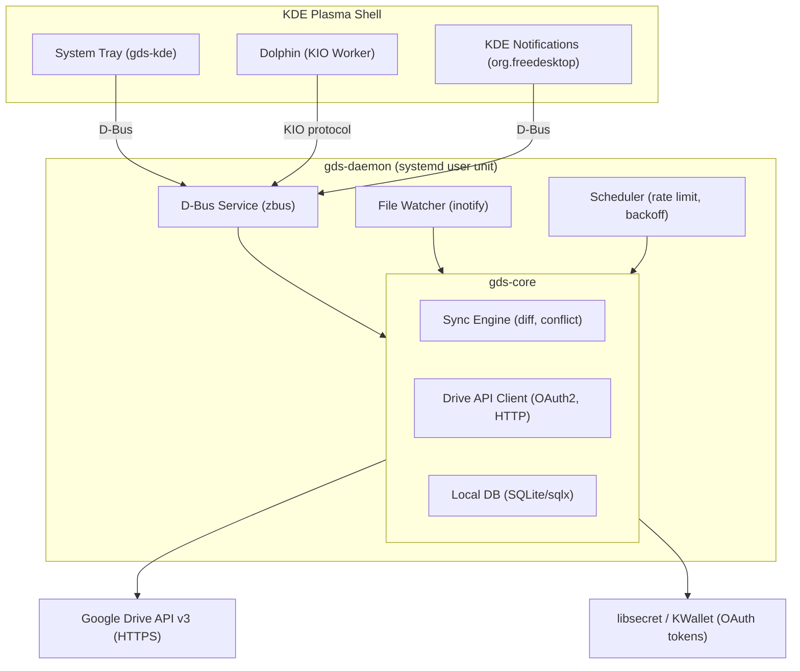
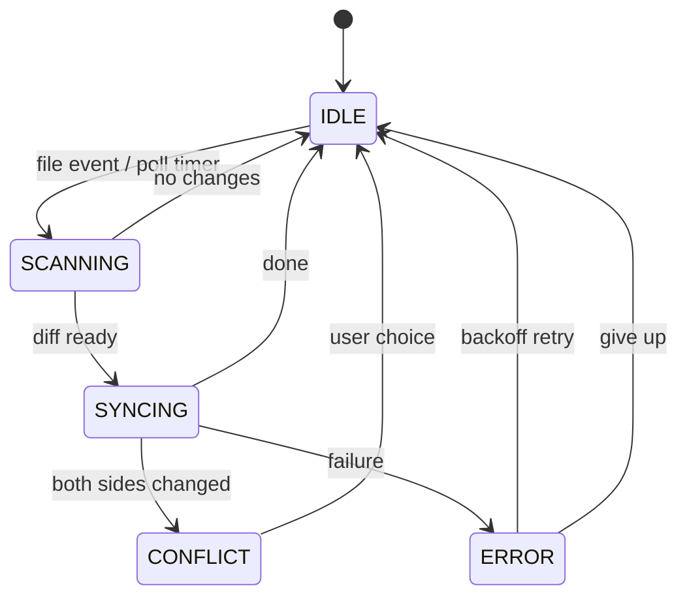
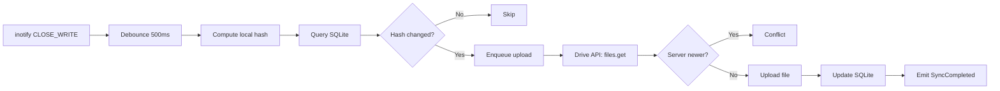
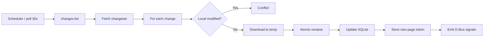
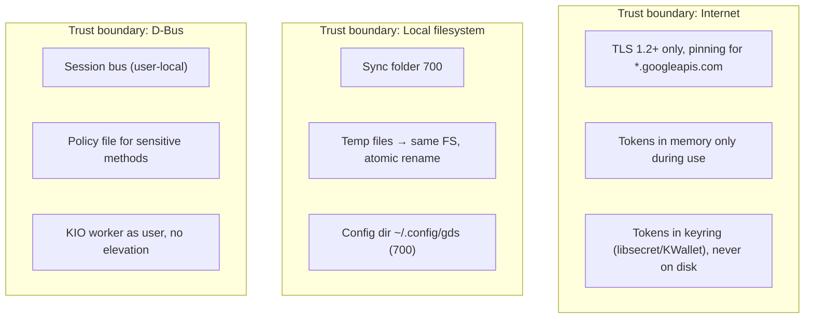
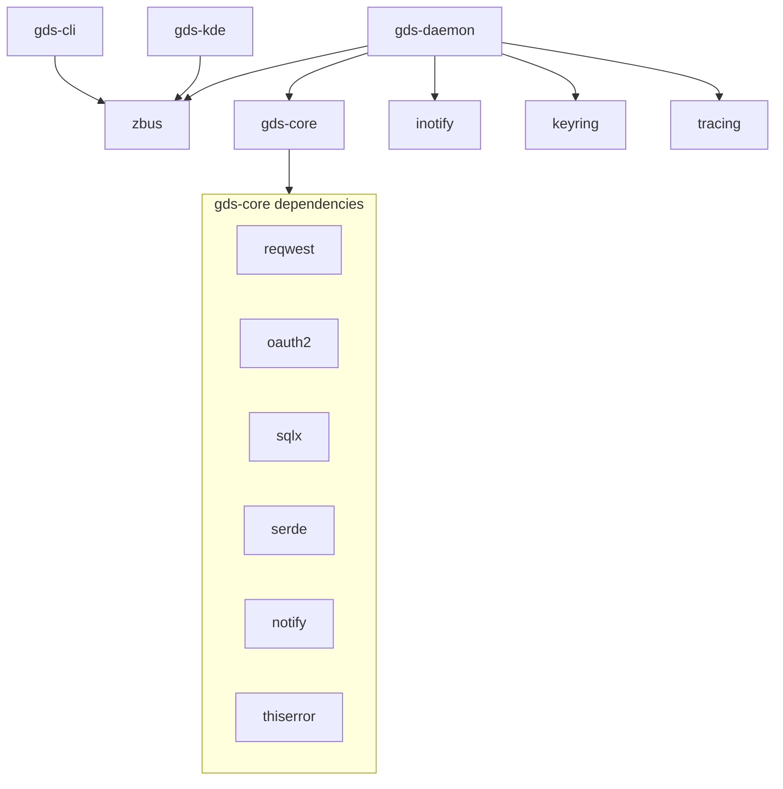
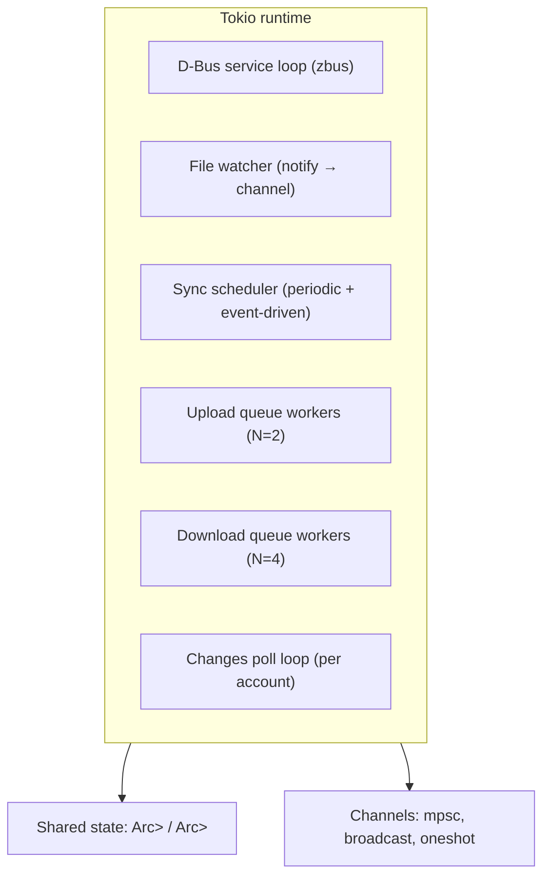

# Architecture

## System Overview



## Sync Engine State Machine



## Conflict Resolution Policy

**Default: Server wins, local copy preserved**

```
Local:  file.txt  (modified at T2)
Server: file.txt  (modified at T3, T3 > T2)

Result:
  ~/GDrive/file.txt                          ← server version
  ~/GDrive/file.conflict-20260313-143022.txt ← local version
```

User is notified via KDE notification with action buttons:
- "Keep mine" → re-uploads local conflict copy
- "View diff" → opens KDiff3 if installed
- "Dismiss" → deletes conflict copy

## Data Flow: Upload



## Data Flow: Download



## SQLite Schema

```sql
CREATE TABLE accounts (
    id          TEXT PRIMARY KEY,  -- UUID
    email       TEXT NOT NULL,
    display_name TEXT,
    keyring_key TEXT NOT NULL,     -- key name in libsecret
    created_at  INTEGER NOT NULL   -- unix timestamp
);

CREATE TABLE sync_folders (
    id              TEXT PRIMARY KEY,  -- UUID
    account_id      TEXT NOT NULL REFERENCES accounts(id),
    local_path      TEXT NOT NULL,
    drive_folder_id TEXT NOT NULL,
    start_page_token TEXT,             -- Drive changes token
    last_sync_at    INTEGER,
    paused          INTEGER NOT NULL DEFAULT 0
);

CREATE TABLE file_states (
    id              TEXT PRIMARY KEY,  -- UUID
    sync_folder_id  TEXT NOT NULL REFERENCES sync_folders(id),
    relative_path   TEXT NOT NULL,
    drive_file_id   TEXT,
    drive_md5       TEXT,
    drive_modified  INTEGER,           -- unix ms
    local_md5       TEXT,
    local_modified  INTEGER,           -- unix ms
    sync_state      TEXT NOT NULL,     -- 'synced', 'pending', 'conflict', 'error'
    last_synced_at  INTEGER,
    UNIQUE(sync_folder_id, relative_path)
);

CREATE TABLE sync_errors (
    id              TEXT PRIMARY KEY,
    file_state_id   TEXT REFERENCES file_states(id),
    error_message   TEXT NOT NULL,
    occurred_at     INTEGER NOT NULL,
    retry_count     INTEGER NOT NULL DEFAULT 0
);

CREATE INDEX idx_file_states_folder ON file_states(sync_folder_id);
CREATE INDEX idx_file_states_drive_id ON file_states(drive_file_id);
```

## Security Boundary Map



## Crate Dependency Graph



## Threading Model



## Portability Notes

- **inotify** is Linux-only. The `notify` crate abstracts this — on macOS it
  uses FSEvents, on Windows ReadDirectoryChangesW. The sync engine depends only
  on the `notify` trait, not the platform backend.
- **KDE-specific** code is fully isolated in `gds-kde` and `kio-worker`.
  `gds-daemon` uses only standard D-Bus (freedesktop) interfaces.
- **GNOME port**: replace `gds-kde` with a GNOME shell extension or GTK4 tray app.
  Core and daemon are unchanged.
- **Static linking**: `cargo build --release` with `RUSTFLAGS='-C target-feature=+crt-static'`
  produces a mostly-static binary. Distribute via Flatpak for full isolation.
