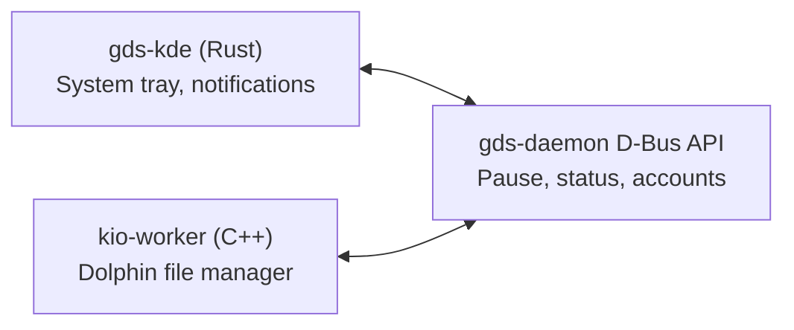
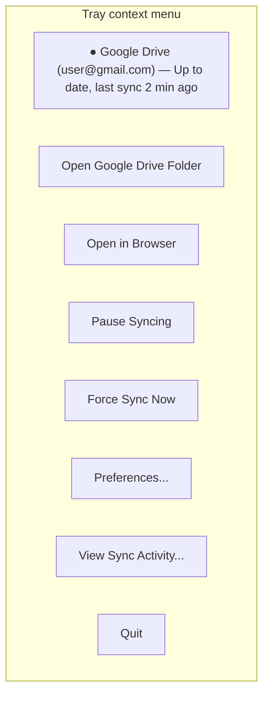

# KDE Integration Guide

## Overview

KDE integration is split into three independent layers, each isolated in its
own binary/library. They communicate only through D-Bus.



## System Tray (StatusNotifierItem)

KDE Plasma uses `org.kde.StatusNotifierItem` (SNI), **not** the legacy XEmbed
tray. Use the `ksni` crate which implements this protocol in Rust.

```toml
# crates/gds-kde/Cargo.toml
[dependencies]
ksni = "0.2"
zbus = { version = "4", features = ["tokio"] }
tokio = { version = "1", features = ["full"] }
```

### Tray States

| Sync State | Icon | Tooltip |
|---|---|---|
| Idle / Up to date | `drive-cloud` (green check overlay) | "Google Drive — Up to date" |
| Syncing | `drive-cloud` (animated spinner overlay) | "Syncing N files..." |
| Paused | `drive-cloud` (pause overlay) | "Google Drive — Paused" |
| Error | `drive-cloud` (error overlay) | "Google Drive — Error: ..." |
| Offline | `drive-cloud` (offline overlay) | "Google Drive — Offline" |

Icons follow the Freedesktop Icon Theme spec. Ship fallback icons in `assets/icons/`
using the hicolor theme at 16, 22, 32, 48, 64, 128px.

### Context Menu



### Tray Implementation Sketch

```rust
use ksni::Tray;

struct GDriveTray {
    dbus: zbus::Connection,
    status: SyncStatus,
}

impl Tray for GDriveTray {
    fn icon_name(&self) -> String {
        match self.status {
            SyncStatus::Idle => "drive-cloud".into(),
            SyncStatus::Syncing => "drive-cloud-syncing".into(),
            SyncStatus::Error => "drive-cloud-error".into(),
            SyncStatus::Paused => "drive-cloud-paused".into(),
        }
    }

    fn menu(&self) -> Vec<ksni::MenuItem<Self>> {
        vec![
            ksni::MenuItem::Standard(ksni::StandardItem {
                label: "Open Google Drive Folder".into(),
                activate: Box::new(|_| {
                    let _ = std::process::Command::new("xdg-open")
                        .arg(dirs::home_dir().unwrap().join("GDrive"))
                        .spawn();
                }),
                ..Default::default()
            }),
            ksni::MenuItem::Separator,
            ksni::MenuItem::Standard(ksni::StandardItem {
                label: "Pause Syncing".into(),
                activate: Box::new(|this: &mut Self| {
                    let conn = this.dbus.clone();
                    tokio::spawn(async move {
                        // call PauseSync via D-Bus
                    });
                }),
                ..Default::default()
            }),
        ]
    }
}
```

## KDE Notifications

Use `org.freedesktop.Notifications` D-Bus interface. KDE renders these with its
own notification daemon, which adds persistence, grouping, and KDE-specific actions.

### Notification Categories

```rust
pub enum NotificationKind {
    SyncComplete { files: u32 },
    ConflictDetected { path: String, conflict_copy: String },
    AuthRequired { account: String },
    Error { message: String },
    LowDiskSpace { available_gb: f64 },
}
```

### Notification with Action Buttons

```rust
// KDE supports action buttons via the actions parameter
async fn notify_conflict(
    conn: &zbus::Connection,
    path: &str,
    conflict_copy: &str,
) -> Result<()> {
    let proxy = zbus::Proxy::new(
        conn,
        "org.freedesktop.Notifications",
        "/org/freedesktop/Notifications",
        "org.freedesktop.Notifications",
    ).await?;

    let actions = vec![
        "keep-mine", "Keep Mine",
        "view-diff", "View Diff",
        "dismiss", "Dismiss",
    ];

    let _id: u32 = proxy.call(
        "Notify",
        &(
            "Google Drive Sync",     // app_name
            0u32,                    // replaces_id
            "dialog-warning",        // icon
            "Sync Conflict",         // summary
            format!("Conflict in {path}. Your version was saved as a conflict copy."),
            actions,
            std::collections::HashMap::<String, zbus::zvariant::Value>::new(),
            10000i32,                // timeout ms (-1 = persistent)
        ),
    ).await?;

    Ok(())
}
```

## KIO Worker (Dolphin Integration)

The KIO worker makes Google Drive appear as a browsable location in Dolphin:
`gdrive:/` or `gdrive://account@gmail.com/`.

**Why C++**: KIO worker API is C++/Qt only. No Rust bindings exist yet.
Keep this layer as thin as possible — it calls the daemon's D-Bus API,
it does NOT contain any sync logic.

### Build Requirements

```bash
# Fedora
sudo dnf install kf6-kio-devel cmake extra-cmake-modules

# Arch
sudo pacman -S kio cmake extra-cmake-modules

# Ubuntu 24.04+
sudo apt install libkf6kio-dev cmake extra-cmake-modules
```

### KIO Worker Methods to Implement

| Method | Description |
|---|---|
| `listDir(url)` | List directory contents |
| `stat(url)` | Get file/dir metadata |
| `get(url)` | Download file |
| `put(url, permissions, flags)` | Upload file |
| `del(url, isfile)` | Delete file or directory |
| `mkdir(url, permissions)` | Create directory |
| `copy(src, dst, permissions, flags)` | Server-side copy (Drive API: files.copy) |
| `rename(src, dst, flags)` | Server-side move/rename (Drive API: files.update) |

### KIO Worker Skeleton

```cmake
# kio-worker/CMakeLists.txt
cmake_minimum_required(VERSION 3.16)
project(kio-gdrive)

find_package(ECM REQUIRED NO_MODULE)
set(CMAKE_MODULE_PATH ${ECM_MODULE_PATH})

find_package(KF6 REQUIRED COMPONENTS KIO)
find_package(Qt6 REQUIRED COMPONENTS Core)

add_library(kio_gdrive MODULE src/gdrivekio.cpp)
target_link_libraries(kio_gdrive KF6::KIOCore Qt6::Core)

install(TARGETS kio_gdrive DESTINATION ${KDE_INSTALL_PLUGINDIR}/kf6/kio)
install(FILES gdrive.protocol DESTINATION ${KDE_INSTALL_KSERVICESDIR})
```

```ini
# kio-worker/gdrive.protocol
[Protocol]
exec=kio_gdrive
protocol=gdrive
input=none
output=filesystem
listing=
reading=true
writing=true
makedir=true
deleting=true
copying=true
moving=true
Icon=drive-cloud
```

### Calling Daemon from KIO Worker

The KIO worker speaks D-Bus to the daemon:

```cpp
// src/gdrivekio.cpp
#include <KIO/WorkerBase>
#include <QDBusInterface>

class GDriveWorker : public KIO::WorkerBase {
public:
    GDriveWorker(const QByteArray &pool, const QByteArray &app)
        : KIO::WorkerBase("gdrive", pool, app)
        , m_daemon("org.kde.GDriveSync",
                   "/org/kde/GDriveSync",
                   "org.kde.GDriveSync.Daemon",
                   QDBusConnection::sessionBus())
    {}

    KIO::WorkerResult listDir(const QUrl &url) override {
        QDBusReply<QVariantList> reply = m_daemon.call("ListDir", url.toString());
        if (!reply.isValid()) {
            return KIO::WorkerResult::fail(KIO::ERR_CANNOT_CONNECT, reply.error().message());
        }
        // ... emit entries
        return KIO::WorkerResult::pass();
    }

private:
    QDBusInterface m_daemon;
};
```

## Autostart

Ship a `.desktop` file for the daemon and tray:

```ini
# assets/org.kde.gdrivesync.desktop
[Desktop Entry]
Type=Application
Name=Google Drive Sync
Comment=Sync files with Google Drive
Exec=gds-kde
Icon=drive-cloud
Categories=Network;FileTransfer;
X-KDE-autostart-phase=2
X-DBUS-ServiceName=org.kde.GDriveSync
```

Install to `~/.config/autostart/` or `/etc/xdg/autostart/`.

Alternatively, ship a systemd user unit:

```ini
# packaging/gds-daemon.service
[Unit]
Description=Google Drive Sync Daemon
After=graphical-session.target network-online.target

[Service]
Type=dbus
BusName=org.kde.GDriveSync
ExecStart=/usr/bin/gds-daemon
Restart=on-failure
RestartSec=5s

[Install]
WantedBy=default.target
```

## Plasma Widget (Future)

A full Plasma widget (written in QML + the daemon D-Bus API) would provide
a richer UI than the system tray. This is post-MVP.

The widget can be developed independently using `gds-daemon`'s D-Bus interface
as its only dependency.

## Testing KDE Integration

```bash
# Test D-Bus service is registered
dbus-send --session --print-reply \
  --dest=org.kde.GDriveSync \
  /org/kde/GDriveSync \
  org.kde.GDriveSync.Daemon.GetStatus

# Test SNI tray is visible
dbus-send --session --print-reply \
  --dest=org.kde.StatusNotifierWatcher \
  /StatusNotifierWatcher \
  org.kde.StatusNotifierWatcher.RegisteredStatusNotifierItems

# Test KIO worker
kioclient5 ls gdrive:/

# Test notifications
notify-send "Test" "Google Drive notification test"
```
